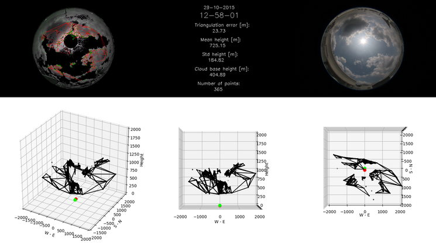

.. Stereographic Cloud Base Reconstruction documentation master file, created by
   sphinx-quickstart on Wed Mar  1 14:16:58 2017.
   You can adapt this file completely to your liking, but it should at least
   contain the root `toctree` directive.

Stereographic Cloud Base Reconstruction
=======================================

This is the documentation for the algorithm presented in the publication "Stereographic Cloud Base Reconstruction using High-Resolution Whole Sky Imagers". Reference to the paper will be provided here upon publication.

This algorithm estimates 3D models of the base of clouds in real world coordinates. It uses two images captured at the same time by two whole sky imagers positioned about 100 meters away. The resulting models have applications in meteorology, solar energy prediction or satellite communication signal attenuation.

The figure below illustrates the algorithm. Both top images are the input images captured at the same time by two sky imagers about 100 meters apart. The left image has been segmented, and displays the feature points used for the reconstruction in green as well as the triangulation in red. The three figures at the bottom show the reconstructed model, from 3D, side and top views. The axis refer to real world coordinates in meters. Please refer to the publication for further details.

Code
----

The code is available on github at https://github.com/FSavoy/cloud-base-reconstruction. It consists of three classes encapsulating functions regarding sky imagers, segmentation and the reconstruction itself. A sample file which generates the figure shown above is provided too.

The documentation is organized as follows:

.. toctree::
   :includehidden:

   code
   
License
-------

This software is released under a 3-Clause BSD License. It is provided "as is" without any warranty. Users are required to obtain the licenses for the required dependencies.

Indices and tables
------------------

* :ref:`genindex`
* :ref:`modindex`
* :ref:`search`
